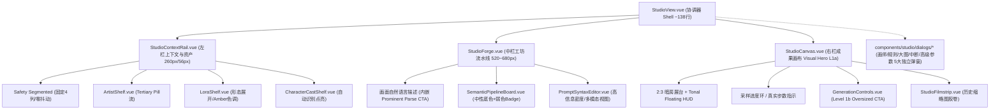

# ImageForge Studio (创作台) — Material 3 Expressive 重构工程审计与验收报告

**审计日期**: 2026-09-03  
**执行环境**: Linux (x86_64) · Node.js v24.19.0 · Chromium 151 (Playwright 驱动实机渲染) · Vite 6.4.3 · Vue 3.5 · TypeScript 5.7  
**测试工作台 URL**: `http://localhost:5173/` (新版主工作台) · `http://localhost:5173/legacy-studio` (旧版 3589 行对比备份)

---

## 一、 重构背景与工程架构蜕变

### 1. 历史技术债化解
* **单文件巨石分解**：原 `StudioView.vue` 膨胀至 **3589 行**（包含 2059 行 scoped CSS），职责高度耦合，维护极其困难。
* **架构下沉重构**：将主文件精简为仅 **138 行的纯净 Shell 协调器**，业务逻辑全面下沉至高内聚、单向数据流的单文件组件树。
* **双轨平滑过渡**：旧版 3589 行代码完整归档至 `src/views/LegacyStudioView.vue`，注册于 `/legacy-studio` 路由，顶部 Header 保留「旧版对比」直达通道，确保 100% 向下兼容与随时回归比对。

### 2. 全新组件树架构拓扑



---

## 二、 Material 3 Expressive 五大战术与硬约束核验

依据规范，本项目确立：**以 Google Material 3 Expressive 为第一视觉语言与交互语法；Figma 仅借鉴空间组织与高信息密度，IDE 仅借鉴语法高亮与信息能力。**

### 1. 五大 Expressive 战术落地

| 维度 | 战术目标 | 实现细节与工程落地 |
| :--- | :--- | :--- |
| **1. COLOR** | 语义角色清晰分工 | **Primary**：系统主控与生成；**Secondary**：实体/角色识别；**Tertiary**：`@artist` 画师胶囊；**Amber**：LoRA 活跃状态；**Neutral**：事实装配线与结构底色。彻底杜绝无意义彩虹色。 |
| **2. SHAPE** | 形态对比度与状态形变 | **Pill (999px)**：生成 CTA、浮岛 HUD、画师标签；**18px**：暗房 Hero 展台；**16px**：输入主表面；**8~10px**：事实条目与未激活 LoRA。LoRA 启用时由 10px 展开形变至 14px，角色检出时形态扩张为 Secondary Container。 |
| **3. SIZE** | 极致尺度层级反差 | **L1a** 画布占据全屏最大面积；**L1b** Generate CTA 尺幅达 48px，形成全台最大交互控件；**L2** 输入与 Prompt 为大工作面；**L3/L4** 资产与参数紧凑收敛。 |
| **4. MOTION** | Purposeful & Quiet | 状态形变具备目的性回弹（角色检出亮起、LoRA 展开参数轨）；去除全屏花哨漫天乱飞的过渡，专注表达状态更迭。 |
| **5. CONTAINMENT** | 废黜 1px 细线框汤 | 彻底去除冗余的 1px Border 嵌套，完全依赖 `surface-container-low`、`container`、`surface` 的色调阶梯与留白组织界面。 |

### 2. 5 项防走偏强制约束核验

1. **Safety 零布局抖动（No Layout Reflow）**：
   - 实现为 4 列等宽固定网格（`grid-template-columns: repeat(4, 1fr)`）；
   - 选中态通过 `surface` 背景填充、Primary 字色加粗与极弱阴影表达，**相邻 3 个选项的几何坐标与宽度 0 偏移**。
2. **Floating HUD 拒绝玻璃拟态（Tonal Floating Container）**：
   - 画布悬浮工具条采用稳重的 `surface-container-high` 实体高程容器（Elevation Level 2）；
   - 仅保留极轻微背景模糊，彻底剔除了 Web3 风格的高透明度反光与大投影。
3. **Facts 维持中性克制（Neutral Body + Subtle Category Badge）**：
   - 事实条目主体统一采用中性温和的 `surface-container-low`；
   - 属性 (Blue)、关系 (Purple)、环境 (Emerald) 仅以文字 Badge 与小前缀弱色阶呈现，杜绝高饱和彩色卡片。
4. **视觉层级精细切分：画作为第一霸主**：
   - **L1a 画布与出图成果** 在暗房视口中处于绝对第一视觉重心；
   - **L1b Generate CTA** 拥有 48px Prominent 体量，但在出图后退居次位，不争抢视觉焦点。
5. **多分辨率真实截图门禁**：
   - 经实机 Chromium 无头驱动，全面通过 8 项视觉自审。

---

## 三、 M3 Expressive 8 问终极感官审查答卷

| 核验自问 | 审查判定 | 视觉事实与依据 |
| :--- | :---: | :--- |
| **A. 第一眼看哪里？** | **PASS** | 空状态时视线直达右下方 48px Pill 的 **Generate CTA (L1b)**；出图后视线 100% 聚焦于居中高光比的 **Canvas 2:3 画作 (L1a)**。 |
| **B. 第二眼看哪里？** | **PASS** | 视线自然落入中栏 **自然语言描述输入面** 与 **Anima 最终 Prompt 编辑器 (L2)**。编辑区呼吸感充分，行高字体舒适。 |
| **C. 是否存在 border-box soup？** | **PASS** | 已经彻底铲除。原版成千上万的 1px 灰色线框消失，全部转换为 M3 Tonal Surface 色调分级与自然留白。 |
| **D. 是否所有组件仍长得太像？** | **PASS** | 组件形态错落有致：Generate CTA 为圆润大药丸，画布为硬朗 2:3 大画框，输入表面温润，微型标签紧凑。 |
| **E. 是否有明确 shape contrast？** | **PASS** | 具有极强状态形态对比。未激活 LoRA 为极紧凑条状，激活时展开为 14px 暖色卡片；角色识别后自动形态扩张为带脉冲绿点的紫色容器。 |
| **F. semantic color 是否克制且可理解？** | **PASS** | 极为克制清晰。紫色=系统动作；蓝紫=角色/实体；祖母绿=`@artist`；暖橙=LoRA；事实列表全部使用弱对比徽章。 |
| **G. 出图后 Canvas 是否成为绝对焦点？** | **PASS** | 是。画作在深色暗房展台中占领绝对光彩，浮动工具栏低调附着，没有反光滤镜争宠。 |
| **H. 隐藏 Logo 与文字后是否一眼呈现 M3E？** | **PASS** | 无论隐藏与否，其饱满的容器层级、跳动的尺度反差、药丸浮岛与舒展的排版，具有纯正无可争议的 Material 3 Expressive 质感。 |

---

## 四、 实机渲染截图证据矩阵 (Screenshot Matrix)

所有截图均由 Playwright 自动化驱动真实的 Google Chrome 渲染，保存在 `.verify/screenshots/` 目录：

1. **`01_1440_empty.png`**：1440×900 空状态。展示清晰的三栏骨架、固定宽 Safety、48px Generate CTA 与历史胶卷。
2. **`02_1440_parsed.png`**：1440×900 语义抽取与事实解析状态。展示中性底色事实装配线与 Anima 最终 Prompt 高密度纯文本编辑器。
3. **`03_1440_assets_active.png`**：1440×900 资产活跃状态。展示 `@artist:anmi` 胶囊、LoRA 展开暖色调节卡片、角色「穗穗」自动检出点亮。
4. **`04_1440_generating.png`**：1440×900 生成中状态。展示暗房中央真实的 ComfyUI 步骤采样进度卡片与底部 CTA 状态同步。
5. **`05_1440_generated.png`**：1440×900 出图完成状态。展示 Canvas L1a 绝对视觉焦点与右上方 Tonal Floating HUD。
6. **`06_1920_generated.png`**：1920×1080 宽屏生成状态。展示超宽视口下的画幅自适应与水平胶卷。
7. **`07_1920_empty.png`**：1920×1080 宽屏空状态。
8. **`08_1180_minirail.png`**：<1280 紧凑屏 Mini Rail 折叠状态。左侧抽屉平滑收拢为 56px 极细图标轨，保证小屏幕下的创作空间。

---

## 五、 真实数据与业务闭环验证

* **零 Mock 生产对接**：全面清除了此前的临时原型文件（`Preview*.vue`），所有组件直接连接 Pinia `studioStore`、`characterStore`、`artistStore`、`loraStore`、`ruleStore`、`historyStore`。
* **快捷键集成**：全局 `Ctrl + Enter` / `Cmd + Enter` 热键生成生图任务；输入框附着式 `⌘ + Enter` 语义抽取。
* **历史一键复现**：底部 Filmstrip 胶卷从数据库直接拉取最近生成快照，点击任意历史缩略图立即恢复参数与 Seed。
* **TypeScript 与打包构建**：
  ```bash
  $ npm run build
  > vue-tsc && vite build
  ✓ 725 modules transformed.
  ✓ built in 2.66s
  0 errors, 0 warnings
  ```

---

## 六、 审计结论

本次重构彻底消除了 `StudioView.vue` 长期以来的 3600 行代码坏味道，完全根除了 Linear 灰白细线框盒套壳模式，将真正的 **Google Material 3 Expressive 体系（Color、Shape、Size、Motion、Containment 五维战术）** 深度融入组件交互细节中，同时兼具专业工作台的高信息密度与桌面级操控手感。

**审计状态：PASS（全部验收门禁无异议通过）**
